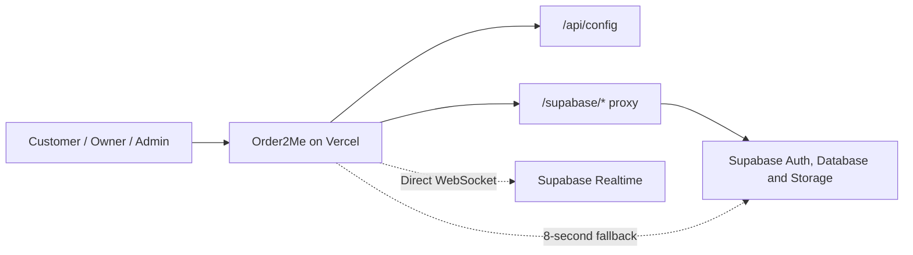

# Order2Me

**Release:** `v1.0.0` · University Edition UCSY

University canteen များအတွက် ပြုလုပ်ထားသော multi-shop food ordering web application ဖြစ်သည်။ Customer များက ဆိုင်နှင့် menu များကိုရွေးပြီး order တင်နိုင်သလို Shop Owner များက menu၊ order နှင့် ဆိုင်ဖွင့်/ပိတ်အခြေအနေကို စီမံနိုင်သည်။ Administrator က owner account နှင့် shop များကို approve/reject လုပ်နိုင်သည်။

🌐 **Live application:** [https://order2me.vercel.app/](https://order2me.vercel.app/)

📖 **အသေးစိတ် documentation:** [PROJECT_DOCUMENTATION_MM.md](PROJECT_DOCUMENTATION_MM.md)

🚀 **Vercel deployment guide:** [VERCEL_DEPLOY.md](VERCEL_DEPLOY.md)


## အဓိကလုပ်ဆောင်ချက်များ

### Customer

- Email/password ဖြင့် account ဖွင့်ခြင်းနှင့် 8-digit email OTP confirmation
- မဖြစ်မနေထည့်ရသော phone number နှင့် ပြင်ဆင်နိုင်သော profile photo
- Approved shop များ၊ shop owner profile နှင့် menu ပုံများကြည့်ခြင်း
- Category/search filter ဖြင့် menu ရှာခြင်း
- Cart ထဲထည့်ပြီး delivery note နှင့် fullscreen ပြုလုပ်နိုင်သော UCSY satellite map ပေါ် delivery point pin ထောက်ကာ order တင်ခြင်း
- KBZPay၊ WavePay payment method နှင့် payment screenshot
- Order status ကို Realtime သို့မဟုတ် polling fallback ဖြင့်ကြည့်ခြင်း
- Owner ကို ဖုန်းခေါ်ရန် profile/call action
- Order ရရှိကြောင်း customer confirmation နှင့် order history
- Email OTP ဖြင့် password reset

### Shop Owner

- Owner signup နှင့် administrator approval workflow
- Shop information၊ opening status နှင့် ordering availability စီမံခြင်း
- Menu item add/edit/delete နှင့် image upload
- Menu item ကို Available/Unavailable ပြောင်းခြင်း
- Desktop tabs သို့မဟုတ် mobile dropdown ဖြင့် availability filter
- Category နှင့် search filter
- Incoming order စာရင်းနှင့် order status workflow
- Business Insights dashboard — revenue၊ sales trend၊ best-selling menu၊ peak hours၊ order performance၊ ratings နှင့် searchable order records
- Customer profile ကြည့်ခြင်းနှင့် phone-call button
- Payment screenshot၊ delivery note နှင့် customer ထောက်ထားသော delivery point ကို map တွင်ကြည့်ခြင်း
- Browser notification၊ sound နှင့် toast alerts

### Administrator

- Pending owner/shop applications ကြည့်ခြင်း
- Owner account approve/reject လုပ်ခြင်း
- User၊ shop နှင့် system activity စီမံကြည့်ရှုခြင်း
- Admin dashboard ကို public signup မပေးဘဲ database မှ bootstrap လုပ်ခြင်း
- Audited user suspension၊ shop force-close နှင့် order cancellation
- Menu/feedback moderation၊ platform announcements နှင့် runtime system settings
- Platform overview၊ cross-shop analytics နှင့် searchable admin audit log
- Moderation ကို shop/customer/state အလိုက်နှင့် audit logs ကို action/entity/admin အလိုက် group/filter လုပ်ခြင်း
- App User နှင့် Shop cards မှ profile detail view ဖွင့်ပြီး contact၊ status၊ shop/menu၊ recent orders နှင့် summary metrics ကြည့်ခြင်း
- Shop cards တွင် contextual primary action သာပြပြီး secondary Suspend/Reject/Force-close actions ကို More menu ထဲထားခြင်း၊ suspend ပြီးသည်နှင့် Restore button ချက်ချင်းပြောင်းခြင်း

## Order workflow

```text
Pending → Preparing → Ready → Out for delivery → Delivered
                                               ↓
                                  Customer confirms receipt
```

## အသုံးပြုထားသောနည်းပညာများ

| အပိုင်း | နည်းပညာ |
|---|---|
| Frontend | HTML5, CSS3, Vanilla JavaScript |
| UI | Bootstrap 5, custom responsive CSS |
| Authentication | Supabase Auth |
| Database | Supabase PostgreSQL |
| File storage | Supabase Storage |
| Live updates | Supabase Realtime + 8-second polling fallback |
| Hosting/API proxy | Vercel |
| PWA | Web App Manifest, Service Worker |
| Alerts | Browser Notification API, sound, toast |

## System architecture



REST/Auth requests များကို Vercel `/supabase/*` rewrite မှတစ်ဆင့်ပို့သောကြောင့် network အချို့တွင် `*.supabase.co` ကိုတိုက်ရိုက်မရောက်နိုင်သည့် `Failed to fetch` ပြဿနာကို လျှော့ချပေးသည်။ Realtime WebSocket ကို direct connection သုံးပြီး မရပါက 8 စက္ကန့် polling fallback ဖြင့် order updates ပြန်ရယူသည်။

## Project structure

```text
Order2Me/
├── api/config.js                 # Runtime public Supabase configuration
├── css/style.css                 # Shared responsive styles
├── images/                       # Logo and static images
├── js/
│   ├── supabase.js               # Supabase clients and proxy configuration
│   ├── auth.js                   # Shared authentication and role guards
│   ├── customer.js               # Customer menu/cart/order dashboard
│   ├── owner.js                  # Owner menu/order/customer dashboard
│   ├── admin.js                  # Administrator dashboard
│   ├── email-confirmation.js     # Signup OTP verification
│   ├── password-recovery.js      # Reset-password OTP flow
│   └── notification-permissions.js
├── supabase/                     # SQL migrations and patches
├── customer.html
├── owner.html
├── admin.html
├── login.html / signup.html
├── confirm-email.html
├── forgot-password.html
├── reset-password.html
├── database.sql                  # Base database schema
├── sw.js                         # PWA shell cache
├── manifest.json
├── vercel.json                   # Vercel rewrite configuration
└── PROJECT_DOCUMENTATION_MM.md
```

## Local development

### လိုအပ်ချက်များ

- Node.js 18 သို့မဟုတ် နောက်ဆုံး LTS
- npm
- Supabase project
- Vercel CLI (`npx vercel` ဖြင့်လည်းသုံးနိုင်သည်)

### 1. Repository ကိုရယူပါ

```bash
git clone <repository-url>
cd Order2Me
npm install
```

### 2. Environment variables သတ်မှတ်ပါ

`.env.example` ကို `.env.local` အဖြစ်ကူးပြီး ကိုယ့် Supabase project တန်ဖိုးများထည့်ပါ။

```env
SUPABASE_URL=https://your-project-ref.supabase.co
SUPABASE_PUBLISHABLE_KEY=sb_publishable_your_key_here
```

Legacy project များတွင် `SUPABASE_ANON_KEY` ကို fallback အဖြစ်ဖတ်နိုင်သော်လည်း `SUPABASE_PUBLISHABLE_KEY` ကိုသုံးရန် အကြံပြုသည်။

> Browser code၊ GitHub repository သို့မဟုတ် `.env.example` ထဲတွင် `service_role` key၊ SMTP password၊ VAPID private key သို့မဟုတ် အခြား secret များ လုံးဝမထည့်ရပါ။

### 3. Vercel rewrite ကိုပြင်ပါ

Fork သို့မဟုတ် Supabase project အသစ်သုံးပါက `vercel.json` ထဲရှိ destination project reference ကို ကိုယ့် project URL ဖြင့်ပြောင်းပါ။

```json
{
  "source": "/supabase/:path*",
  "destination": "https://your-project-ref.supabase.co/:path*"
}
```

### 4. Local server run ပါ

```bash
npx vercel dev
```

Terminal ပြသော URL—ပုံမှန်အားဖြင့် `http://localhost:3000`—ကိုဖွင့်ပါ။ VS Code Live Server တစ်ခုတည်းဖြင့် run လျှင် `/api/config`၊ `.env.local` နှင့် Vercel rewrite မအလုပ်လုပ်သောကြောင့် login တွင် `Failed to fetch` ဖြစ်နိုင်သည်။

## Database setup

SQL ဖိုင်များကို **Supabase Dashboard → SQL Editor** မှ run ပါ။ Production database ကိုပြင်မီ backup ယူပါ။ Run ပြီးသား migration ကို မသေချာဘဲ ထပ်မ run ပါနှင့်။

### Fresh project

1. `database.sql` — base tables မရှိသေးမှသာ
2. `supabase/multi_shop_migration.sql`
3. `supabase/shop_availability.sql`
4. `supabase/profile_images.sql`
5. `supabase/customer_read_owner_profile_images.sql`
6. `supabase/customer_received_confirmation.sql`
7. `supabase/admin_users_notifications_screenshot_patch.sql`
8. `supabase/required_account_contact.sql`
9. `supabase/remove_cash_payment.sql` — payment အသစ်များအတွက် KBZPay/WavePay သာလက်ခံရန်
10. `supabase/order_feedback.sql` — delivered order rating/comment နှင့် Owner feedback view
11. `supabase/order_queue_tracking.sql` — FIFO queue၊ estimated arrival နှင့် status timestamps
12. `supabase/create_admin.sql` — placeholder email ကိုပြင်ပြီး run ရန်
13. `supabase/v1_security_lockdown.sql` — နောက်ဆုံး run ရမည့် anonymous-access lockdown
14. `supabase/admin_control_center.sql` — Admin audit/RPC foundation၊ user/shop/order controls၊ moderation၊ announcements၊ system settings နှင့် analytics
15. `supabase/admin_control_center_fix.sql` — Suspension/session enforcement၊ working system limits၊ distinct audit events နှင့် production corrective fixes
16. `supabase/order_delivery_location.sql` — Customer map pin coordinates နှင့် owner-only delivery location protection

လိုအပ်သည့် existing database များတွင်သာ `supabase/allow_duplicate_profile_names.sql` ကို run ပါ။ Abandoned Web Push objects ရှိသေးလျှင် `supabase/remove_web_push.sql` ဖြင့်ဖယ်ရှားနိုင်သည်။

### Existing project

Existing database တွင် `database.sql` အားလုံးကို ပြန်မ run ပါနှင့်။ လိုအပ်သော migration/patch များကို schema နှင့် migration history စစ်ပြီးမှ တစ်ခုချင်း run ပါ။ အသေးစိတ်ကို [PROJECT_DOCUMENTATION_MM.md](PROJECT_DOCUMENTATION_MM.md) တွင်ကြည့်နိုင်သည်။

### Admin Control Center update

Admin feature အသစ်များအသုံးပြုရန် existing project တွင် အောက်ပါ SQL နှစ်ဖိုင်ကို အစဉ်လိုက် run ပါ။ ပထမဖိုင် run ပြီးသားဖြစ်ပါက corrective patch တစ်ခုတည်း run နိုင်သည်။

```text
supabase/admin_control_center.sql
supabase/admin_control_center_fix.sql
```

Corrective patch ပြီးနောက်—

- Suspended customer/owner သည် အများဆုံး 15 စက္ကန့်အတွင်း sign out ဖြစ်ပြီး ပြန်ဝင်၍မရပါ။ Historical records မဖျက်ပါ။
- Suspend RPC အောင်မြင်သည်နှင့် user card ရှိ `Suspend user` button သည် `Restore access` သို့ ချက်ချင်းပြောင်းပြီး database list နှင့် background sync ပြန်လုပ်သည်။
- Shop suspend/force-close သည် database order acceptance ကိုပိတ်ပါသည်။
- `ordering_enabled=false` သို့မဟုတ် `maintenance_mode=true` ဖြစ်လျှင် order အသစ်တင်၍မရပါ။
- `maximum_order_amount` ကို order insert policy ကစစ်ပါသည်။
- `owner_signup_enabled=false` ဖြစ်လျှင် owner profile အသစ်ဖန်တီး၍မရပါ။
- `feedback_enabled=false` ဖြစ်လျှင် feedback အသစ်တင်၍မရပါ။
- Admin sensitive action တစ်ခုစီသည် `admin_audit_logs` တွင် distinct action name၊ old/new values နှင့် reason တစ်ကြောင်းစီရေးပါသည်။
- Announcement end time ထည့်ပါက လက်ရှိအချိန်ထက် အနည်းဆုံးတစ်မိနစ်နောက်ကျရပြီး end time မလိုလျှင် အလွတ်ထားနိုင်သည်။
- Menu moderation ကို ဆိုင်အလိုက် group လုပ်ပြီး shop နှင့် visible/hidden state အလိုက် filter လုပ်နိုင်သည်။ Feedback moderation တွင် shop အပြင် customer အလိုက်ပါ filter လုပ်နိုင်သည်။
- Audit logs ကို entity type အလိုက် group လုပ်ပြီး action၊ entity type၊ လုပ်ဆောင်ခဲ့သော admin နှင့် search text အလိုက် ခွဲကြည့်နိုင်သည်။

Payment proof ကို Owner က order လက်ခံစဉ်စစ်ပြီး မမှန်ပါက order cancel လုပ်သည့် workflow ကိုဆက်သုံးပါသည်။ Admin dashboard တွင် payment verification မပါဝင်ပါ။

Migration ပြီးလျှင် Vercel redeploy လုပ်ပြီး Service Worker cache အဟောင်းမကျန်စေရန် hard refresh လုပ်ပါ။ Audit verification အတွက် SQL ဖိုင်အဆုံးရှိ query ကို run နိုင်သည်။

## Supabase configuration

### Authentication

Supabase Dashboard တွင်—

```text
Authentication → Sign In / Providers → Email → Confirm email = ON
```

Application က Signup Confirmation နှင့် Password Recovery အတွက် **8-digit email OTP** သုံးသည်။ Email templates တွင် confirmation link အစား `{{ .Token }}` ပါရမည်။

```html
<h2>Your Order2Me confirmation code</h2>
<p>Use this code to activate your account:</p>
<h1>{{ .Token }}</h1>
```

Password Recovery template တွင်လည်း `{{ .Token }}` ကိုအသုံးပြုပါ။

### URL configuration

```text
Site URL:
https://order2me.vercel.app

Redirect URLs:
https://order2me.vercel.app/login.html
https://order2me.vercel.app/login.html?verified=1
https://order2me.vercel.app/reset-password.html
http://localhost:3000/login.html
http://localhost:3000/login.html?verified=1
http://localhost:3000/reset-password.html
```

ကိုယ့် domain သုံးပါက production URL များကို ကိုယ့် domain ဖြင့်ပြောင်းပါ။

### Email delivery / Custom SMTP

Supabase default email service သည် production အတွက်မရည်ရွယ်ဘဲ rate limit ရှိသည်။ Production သုံးရန် Custom SMTP configure လုပ်ပါ။ Gmail Spam folder ထဲရောက်နိုင်ခြေကို လျှော့ချရန်—

- ကိုယ်ပိုင် sending domain သုံးပါ (`no-reply@your-domain.com`)
- SPF၊ DKIM နှင့် DMARC records မှန်ကန်စွာသတ်မှတ်ပါ
- OTP email ကိုတိုတိုရှင်းရှင်းထားပြီး link၊ image နှင့် promotional content မများစေပါနှင့်
- Personal `@gmail.com` address ကို third-party SMTP မှ `From` address အဖြစ်သုံးခြင်းကိုရှောင်ပါ

Application ၏ OTP စာမျက်နှာများတွင် Inbox မတွေ့လျှင် Spam/Junk folder စစ်ရန် အသိပေးထားသည်။ သို့သော် deliverability ကို frontend code တစ်ခုတည်းဖြင့် အာမခံမပေးနိုင်ပါ။

### Realtime နှင့် Storage

Supabase Realtime publication တွင် `orders` table ပါရမည်။ Menu images၊ profile avatars နှင့် payment screenshots အတွက် migration များတွင်ဖော်ပြထားသော Storage bucket/policies များလိုအပ်သည်။ Realtime၊ table RLS နှင့် Storage RLS ကို customer/owner role နှစ်ခုလုံးဖြင့်စမ်းသပ်ပါ။

## Vercel deployment

1. Repository ကို Vercel project နှင့်ချိတ်ပါ။
2. Project Settings → Environment Variables တွင် `SUPABASE_URL` နှင့် `SUPABASE_PUBLISHABLE_KEY` ထည့်ပါ။
3. `vercel.json` destination သည် သုံးမည့် Supabase project နှင့်ကိုက်ကြောင်းစစ်ပါ။
4. Deploy သို့မဟုတ် Redeploy လုပ်ပါ။
5. `/api/config` response၊ login နှင့် `/supabase/auth/v1/...` requests ကိုစမ်းပါ။

CLI ဖြင့် deploy လုပ်လိုပါက—

```bash
npx vercel
npx vercel --prod
```

အသေးစိတ်အဆင့်များကို [VERCEL_DEPLOY.md](VERCEL_DEPLOY.md) တွင်ဖတ်နိုင်သည်။

## Testing checklist

Release မလုပ်မီ Customer၊ Owner နှင့် Admin account သုံးခုဖြင့် အောက်ပါ end-to-end flow ကိုစမ်းပါ။

- [ ] Customer signup → 8-digit OTP → login
- [ ] Forgot password → recovery OTP → new password login
- [ ] Owner signup → pending page → Admin approval
- [ ] Owner shop availability open/closed
- [ ] Menu add/edit/delete၊ image upload နှင့် Available/Unavailable filter
- [ ] Customer shop/menu view၊ cart နှင့် order placement
- [ ] UCSY satellite map ပေါ် marker ထောက်ပြီး Owner ဘက် `View delivery point` link မှ နေရာမှန်ဖွင့်ခြင်း
- [ ] KBZPay/WavePay နှင့် payment screenshot order
- [ ] Owner receives new order and changes every status
- [ ] Customer receives status updates and confirms receipt
- [ ] Customer rates a delivered order and Owner can view the feedback
- [ ] Customer/Owner profile view နှင့် phone-call action
- [ ] Order history
- [ ] Android mobile layout၊ notification permission နှင့် VPN မပါသော network
- [ ] Customer က တခြား customer order မမြင်နိုင်ခြင်း
- [ ] Owner က တခြား shop data မပြင်နိုင်ခြင်း
- [ ] Service Worker update ပြီးနောက် latest UI ပေါ်ခြင်း

## Notifications နှင့် လက်ရှိကန့်သတ်ချက်များ

- လက်ရှိ notifications သည် Browser Notification API၊ sound၊ toast နှင့် Realtime/polling detection ကိုသုံးသည်။
- Full background Web Push backend မဟုတ်သောကြောင့် browser/app လုံးဝပိတ်ထားချိန် notification delivery ကိုအာမခံမပေးနိုင်ပါ။
- ISP/network က Supabase Realtime WebSocket ကိုပိတ်ထားလျှင် update သည် polling interval ကြောင့် 8 စက္ကန့်ခန့်နောက်ကျနိုင်သည်။
- Email Inbox placement သည် SMTP provider၊ sender reputation နှင့် SPF/DKIM/DMARC configuration ပေါ်မူတည်သည်။
- Service Worker က static app shell ကို cache လုပ်သည်။ Deploy ပြီးနောက် UI အဟောင်းပေါ်လျှင် hard refresh သို့မဟုတ် site data clear လုပ်ပါ။

## Troubleshooting

### Login တွင် `Failed to fetch`

- Vercel Environment Variables ရှိမရှိစစ်ပါ။
- `/api/config` ကိုဖွင့်ပြီး configuration error ရှိမရှိကြည့်ပါ။
- `vercel.json` ထဲရှိ Supabase project reference မှန်မမှန်စစ်ပါ။
- Local တွင် Live Server အစား `npx vercel dev` သုံးပါ။

### Order update ချက်ချင်းမရ

- Browser console မှ Realtime status စစ်ပါ။
- Supabase publication ထဲ `orders` ပါမပါစစ်ပါ။
- RLS select policies ကို customer/owner role နှစ်ခုလုံးဖြင့်စမ်းပါ။
- 8-second polling နောက် update ပြန်ရမရကြည့်ပါ။

### OTP email မရ သို့မဟုတ် Spam ထဲရောက်

- Supabase Auth Logs နှင့် SMTP provider logs စစ်ပါ။
- Email template တွင် `{{ .Token }}` ပါကြောင်းစစ်ပါ။
- Rate limit မကျော်ကြောင်းစစ်ပါ။
- Spam/Junk folder နှင့် sender domain ၏ SPF၊ DKIM၊ DMARC results ကိုစစ်ပါ။

### Image မပေါ်

- Storage bucket နှင့် object path မှန်မမှန်စစ်ပါ။
- Storage RLS policies ကို သက်ဆိုင်ရာ role ဖြင့်စမ်းပါ။
- Public URL နှင့် private/signed URL အသုံးပြုပုံ မရောထွေးကြောင်းစစ်ပါ။

## Security notes

- Frontend တွင် Supabase publishable/anon key သာသုံးပါ။ Security ကို Row Level Security policies ဖြင့်ကာကွယ်ရသည်။
- `service_role` key ကို browser၊ Vercel client config သို့မဟုတ် GitHub ထဲမထည့်ပါနှင့်။
- `.env.local` နှင့် `*.local.sql` ကဲ့သို့ secret ပါနိုင်သောဖိုင်များကို commit မလုပ်ပါနှင့်။
- Admin account ကို public signup မှမဖန်တီးဘဲ Supabase Auth user + `create_admin.sql` ဖြင့်သာ bootstrap လုပ်ပါ။
- User-provided strings ကို HTML ထဲထည့်မီ escape/sanitize လုပ်ပါ။
- Database backup မရှိဘဲ destructive migration မ run ပါနှင့်။

## Documentation

- [မြန်မာဘာသာ Project Documentation](PROJECT_DOCUMENTATION_MM.md)
- [Vercel Deployment Guide](VERCEL_DEPLOY.md)

## Project status

Order2Me တွင် multi-shop ordering၊ role-based dashboards၊ admin approval၊ menu/profile images၊ payment proof၊ customer/owner phone actions၊ shop/menu availability၊ Realtime with polling fallback၊ browser alerts၊ email confirmation OTP နှင့် password recovery flow များပါဝင်ပြီး university project demonstration အတွက် feature-complete အခြေအနေဖြစ်သည်။

Production release မတိုင်မီ final end-to-end testing၊ Supabase migration audit၊ authenticated SMTP domain နှင့် security/RLS testing ပြုလုပ်ရန်လိုအပ်သည်။

---

Built as a university project for a simpler canteen ordering experience.
hi
