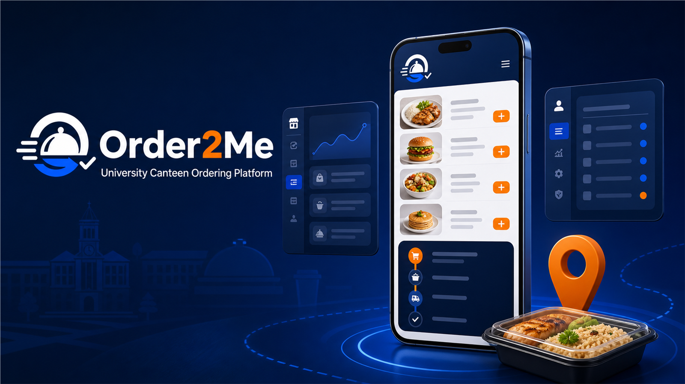

# Order2Me



<p align="center">
  <strong>A mobile-first, multi-shop university canteen ordering platform for UCSY.</strong>
</p>

<p align="center">
  <a href="https://order2me.vercel.app/"><strong>Live Demo</strong></a>
  ·
  <a href="https://github.com/TheprimeV/Order2Me"><strong>Source Code</strong></a>
  ·
  <a href="PROJECT_DOCUMENTATION_MM.md"><strong>Myanmar Documentation</strong></a>
</p>

## Overview

Order2Me connects university customers, canteen shop owners, and platform administrators through dedicated role-based experiences.

Customers can discover shops, order food, attach digital-payment proof, select a campus delivery point, and track order progress. Shop owners can manage menus, process incoming orders, contact customers, and review business performance. Administrators can supervise users, shops, orders, moderation, announcements, settings, analytics, and audit history.

The project was designed around real delivery and network constraints at the University of Computer Studies, Yangon (UCSY).

## Why I Built It

Traditional canteen ordering creates several problems:

- Customers spend time waiting in queues.
- Shop owners receive unclear order and delivery information.
- Customers cannot reliably see an order's current status.
- Public navigation services do not represent every internal campus road.
- Multiple shops need secure separation of orders, customers, and payments.
- Realtime WebSocket connections can be unreliable on some networks.

Order2Me brings these workflows into one responsive web application while retaining practical fallbacks for mobile devices and unstable connections.

## Core Features

### Customer

- Email/password authentication with 8-digit email verification and password recovery
- Approved shop discovery, owner profiles, menu search, and category filters
- Shopping cart with duplicate-submission protection
- KBZPay and WavePay payment proof
- Landmark-first UCSY delivery selection
- GPS-assisted detection of nearby landmarks and hostels
- Optional controlled OpenStreetMap picker for custom locations
- Required delivery note and owner call action
- Live order timeline, estimated arrival, and delayed-order alerts
- Customer receipt confirmation, feedback, and order history
- Editable account information and profile image

### Shop Owner

- Shop application and administrator approval workflow
- Shop information, opening hours, availability, and preparation-time controls
- Menu create, edit, delete, image upload, search, and availability filters
- Incoming-order workflow from pending to customer-confirmed delivery
- Payment-proof review and reason-based cancellation
- Delivery landmark, customer note, profile, and phone action
- Customer directory scoped to the owner's shop
- Revenue, sales, menu, peak-hour, rating, and order analytics
- Realtime, polling, browser, sound, and toast notifications

### Administrator

- Platform overview and attention statistics
- Detailed user and shop profile views
- User suspension and restoration
- Shop approval, rejection, suspension, force-close, and reopening
- Cross-shop order search, details, and cancellation
- Menu and feedback moderation
- Announcement publishing and deletion
- Runtime system settings
- Cross-shop analytics
- Searchable audit logs with administrator, action, entity, reason, and before/after values

## Delivery-Location UX

Campus roads are not always represented correctly by external navigation services. Instead of forcing every customer to use a map, Order2Me uses a landmark-first workflow:

1. The customer chooses a known UCSY landmark or hostel.
2. **Use my location** matches the GPS position to the nearest known landmark when possible.
3. The map opens only when the customer selects **Other location**.
4. The custom map restricts zoom and movement to the UCSY area and uses a persistent CSS marker.
5. The owner sees the landmark, delivery note, and call button before any external-map action.

Known locations include the canteen, library, Building E, main entrance, football field, Alinkar Hostel, Mudra Hostel, and Depa Hostel.

## Order Workflow

```text
Pending → Preparing → Ready → Out for delivery → Delivered
                                               ↑
                                  Customer confirms receipt
```

Cancellation reasons remain visible in order history for accountability.

## Technology Stack

| Area | Technology |
|---|---|
| Frontend | HTML5, CSS3, Vanilla JavaScript |
| UI | Bootstrap 5, custom responsive design |
| Authentication | Supabase Auth |
| Database | Supabase PostgreSQL |
| Authorization | PostgreSQL Row Level Security |
| File storage | Supabase Storage |
| Live updates | Supabase Realtime with polling fallback |
| Maps | Leaflet and OpenStreetMap |
| Hosting | Vercel |
| PWA | Service Worker and Web App Manifest |

## Architecture

```mermaid
flowchart LR
    U[Customer / Owner / Admin] --> V[Order2Me on Vercel]
    V --> C[/api/config]
    V --> P[/supabase proxy]
    P --> S[Supabase Auth]
    P --> D[PostgreSQL + RLS]
    P --> F[Supabase Storage]
    V -. WebSocket .-> R[Supabase Realtime]
    V -. Polling fallback .-> D
```

REST, Auth, and Storage requests use a Vercel same-origin proxy. Realtime uses a direct authenticated WebSocket connection, with polling available when that connection is blocked or interrupted.

## Security Highlights

- Role-based guards for customer, owner, and administrator pages
- Database-level Row Level Security for user and shop isolation
- Private payment screenshots with controlled signed access
- Protected administrative, moderation, and delivery-location fields
- Security-definer administrative RPC functions with internal authorization checks
- Suspension enforcement at the operational database-identity layer
- Required reasons and audit records for sensitive administrative actions
- Browser-safe publishable key only; no service-role key in frontend code
- Escaped user-provided content before dynamic HTML rendering

## Project Structure

```text
Order2Me/
├── api/config.js                 # Runtime browser configuration
├── css/style.css                 # Shared responsive styles
├── images/                       # Branding and portfolio assets
├── js/
│   ├── auth.js                   # Authentication and role guards
│   ├── customer.js               # Customer ordering experience
│   ├── owner.js                  # Owner operations dashboard
│   ├── owner-analytics.js        # Business insights
│   ├── admin.js                  # Approval dashboard
│   ├── admin-control.js          # Administrative control centre
│   ├── profile.js                # Profile-image workflows
│   ├── runtime-controls.js       # Settings and announcements
│   └── supabase.js               # Supabase clients
├── scripts/verify.mjs            # Automated project verification
├── supabase/                     # SQL migrations and security patches
├── customer.html
├── owner.html
├── admin.html
├── database.sql                  # Base database schema
├── manifest.json
├── sw.js
└── vercel.json
```

## Local Setup

### Prerequisites

- Node.js 18 or newer
- npm
- A Supabase project
- Vercel CLI, available through `npx vercel`

### Installation

```bash
git clone https://github.com/TheprimeV/Order2Me.git
cd Order2Me
npm install
```

Copy `.env.example` to `.env.local` and configure the browser-safe project credentials:

```env
SUPABASE_URL=https://your-project-ref.supabase.co
SUPABASE_PUBLISHABLE_KEY=sb_publishable_your_key_here
```

Update the Supabase project URL in `vercel.json`, then run:

```bash
npx vercel dev
```

Use the Vercel development server instead of a basic static server because Order2Me depends on `/api/config` and the `/supabase/*` rewrite.

## Database Setup

Run the SQL files from the Supabase SQL Editor. Back up an existing database before applying migrations.

<details>
<summary><strong>Fresh project migration order</strong></summary>

1. `database.sql`
2. `supabase/multi_shop_migration.sql`
3. `supabase/shop_availability.sql`
4. `supabase/profile_images.sql`
5. `supabase/customer_read_owner_profile_images.sql`
6. `supabase/customer_received_confirmation.sql`
7. `supabase/admin_users_notifications_screenshot_patch.sql`
8. `supabase/required_account_contact.sql`
9. `supabase/remove_cash_payment.sql`
10. `supabase/order_feedback.sql`
11. `supabase/order_queue_tracking.sql`
12. `supabase/create_admin.sql` after replacing its placeholder email
13. `supabase/v1_security_lockdown.sql`
14. `supabase/admin_control_center.sql`
15. `supabase/admin_control_center_fix.sql`
16. `supabase/order_delivery_location.sql`

</details>

Do not rerun the complete base schema against an existing production database. Review the migration history and apply only the required patches.

## Verification

Run the project verifier before deployment:

```bash
npm test
```

Or run it directly:

```bash
node scripts/verify.mjs
```

The verifier checks JavaScript syntax, local asset references, duplicate HTML IDs, and JSON configuration.

Production testing should also cover:

- Customer signup, verification, login, and password recovery
- Owner signup, pending state, and administrator approval
- Complete order placement and status workflow
- Landmark, GPS, and custom-map delivery selection
- Payment screenshot access for the correct customer and shop
- Feedback and customer receipt confirmation
- Suspension, force-close, announcements, settings, and audit logs
- RLS negative tests using customer, owner, and administrator accounts
- Mobile layout, Realtime failure, polling fallback, and Service Worker updates

## Engineering Challenges

- Resolved ambiguous PostgREST relationships with explicit foreign keys and staged profile hydration.
- Added polling and connection-state handling for networks that block Realtime WebSockets.
- Replaced an unreliable satellite overlay with landmark-first selection and an optional controlled map.
- Built database-authorized administrative RPC functions and detailed audit logging.
- Added backward-compatible query fallbacks while the database schema evolved through migrations.
- Improved mobile dashboards with contextual actions instead of overcrowded control panels.

## Current Limitations

- Notifications depend on an open browser/PWA session; full background Web Push is not included.
- Email delivery quality depends on the configured SMTP provider and sender-domain reputation.
- External maps may not contain every UCSY internal road, so landmark and customer-note information remains primary.
- Supabase Free Plan quotas require careful query, polling, image-size, and cache management.

## Future Improvements

- Compress and resize user uploads before storage
- Move high-frequency operations behind a dedicated backend API
- Add atomic order creation through a database transaction/RPC
- Add automated browser-based end-to-end tests
- Support additional universities through configurable campus landmarks
- Add full background push notifications

## What This Project Demonstrates

Order2Me demonstrates full-stack product development across user research, mobile UX, relational data modelling, authentication, database authorization, file storage, live updates, administrative tooling, analytics, deployment, debugging, and technical documentation.

It also reflects an iterative engineering process: real usability and integration problems were identified, tested, and redesigned rather than hidden behind a prototype-only interface.

## Links

- **Live application:** https://order2me.vercel.app/
- **GitHub repository:** https://github.com/TheprimeV/Order2Me
- **Myanmar project documentation:** [PROJECT_DOCUMENTATION_MM.md](PROJECT_DOCUMENTATION_MM.md)
- **Deployment guide:** [VERCEL_DEPLOY.md](VERCEL_DEPLOY.md)

---

Built as a personal full-stack project for a simpler university canteen experience.
